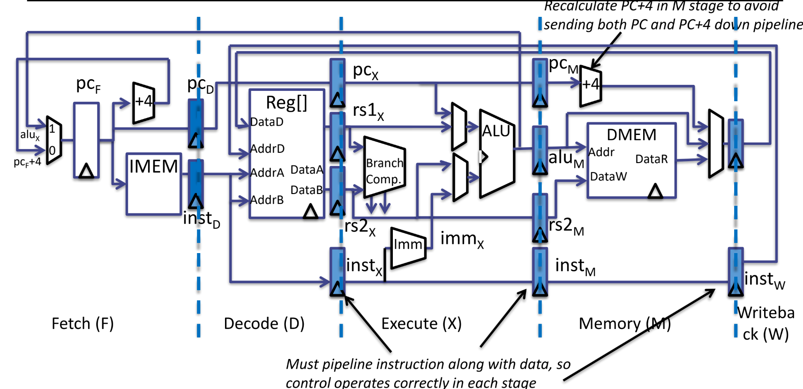

# 5-stage-pipelined-RISC-V-core
 
A five-stage pipeline RISC-V architecture(RV32I Core instruction set) implementation using Verilog HDL. All the functional modules including the Hazard detection and Stall, Forwarding, Branch Prediction, and the five pipeline stages are simulated and verified.
